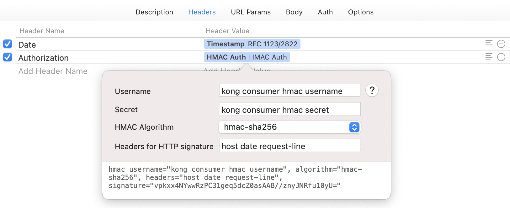

# Kong HMAC Authentication Dynamic Value (Paw Extension)

A Paw Extension to compute Kong HMAC authentication signatures for the accessing the Kong RESTful APIs.

## Sample

* Fill in the HMAC **Username** and **Secret** set in the Kong
* Select the HMAC **Algorithm** set by the API
* Enter the **HTTP headers** used to generate the signature(the default is `host date request-line`)

Note that in addition to `host` and `request-line`, other headers must already exist in the HTTP Headers. 

If it is a date header, you can use the **Timestamp** value in RFC 1123/2822 format as above.

